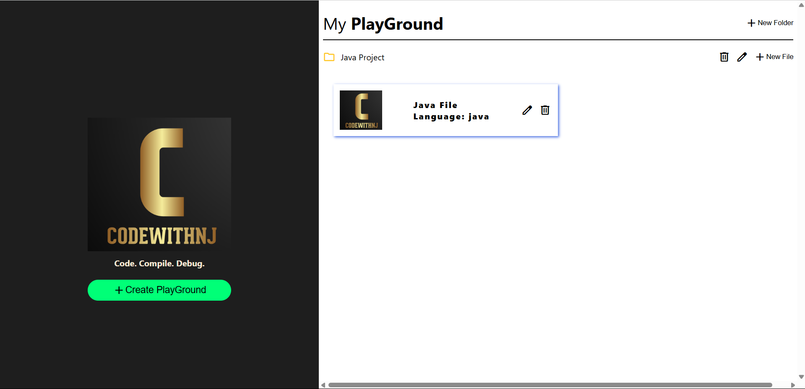

# CodeWithNJ - Online Code Playground

A web-based **code playground** built with **React** and **Monaco Editor** that supports writing, running, and managing multiple code files and projects. It integrates with the **Judge0 API** to compile and execute code in various programming languages.

---

## Features

- Rich code editor powered by [Monaco Editor](https://github.com/microsoft/monaco-editor) (the same editor used in VS Code)
- Syntax highlighting and themes (light/dark)
- Create, edit, and delete multiple projects, folders, and files
- Support for multiple programming languages (e.g., Java, C++, Python, javascript)
- Compile and run code via Judge0 API
- Save, import, and export code files and projects
- Input and output panels for testing code interactively
- Responsive and clean UI with project/file navigation

---

## Screenshots

---
